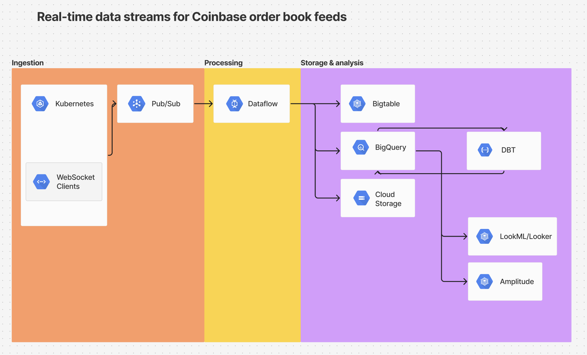

# Core Cloud Design

*Sketch or outline a high-level cloud data architecture that could support real-time ingestion and storage of the Coinbase data stream, emphasizing fault tolerance, scalability, and storage.
Briefly describe which components or services (e.g., a cloud provider’s streaming service, data storage formats) you would use and why.*

- First, we could connect WebSocket clients to Coinbase which could be hosted on **Google Kubernetes Engine**. Kubernetes have good support for persistent connections such as WebSocket and we could configure an autoscaler that would help with scalability. Having multiple instances of websocket clients, one for each currency pair or even multiple for the same currency pair if there is a critical need to get this data constantly, would also help with fault tolerance since Kubernetes is able to manage load balancing. We should validate data as soon as it is received and get a new snapshot in case of inconsistencies or errors.
- In order to buffer the incoming data, we can use **Google Pub/Sub** which would automatically scale to handle high volume of data. By separating the ingestion from processing, we limit the risk and allow each to scale independantly. Moreover, PubSub balances the load itself to consumers and ensures that messages are delivered once.
- We could then use **Dataflow** as the main service to process streaming data in real-time from Pub/Sub. This would allow us to handle erros and retries before the data reaches storage. **Dataflow** is able to automatically scale resources based on the workload. In case of failure in the pipeline, Dataflow ensures that no duplicate processing happens which also improves fault tolerance and minimizes the workload, improving scalability. We also want to include validation steps during transformation to ensure we produce consistent data, as well as implement tests on processed data to avoid abherant results being streamed further. We might also want to set up deduplication logic in case we have multiple instances of WebSocket clients running for the same currency pair and delivering duplicated batch updates.
- As for storage, we would like to start by storing the raw, incoming data from Datflow in **Google cloud storage** to keep a copy of them before any wrangling done at later stages and ensures data integrity even if the pipeline breaks down the stream.
- Assuming that there is a need for low-latency access to real-time analytics, we could use **Google BigTable** which would scale well even with high workload and is higher in performance in terms of latency. For other analytical use cases, we could also write directly to **Google BigQuery** from Dataflow which is designed to handle large amount of data and is more cost-effective when scaling. There, we could wrangle the data with **DBT** in order to make it ready to serve standardized or customized analytics use cases. We also would implement tests on DBT to make sure the data is still complete and consistent. Given that we're working with events data, we can also optimize the models at this point by using clustering, limit the workload by using incremental modelisation which would also reduce query time on BigQuery and in later stages of the pipeline.
- The last step is to serve the data to the stakeholder depending on the use cases, which could be either **API endpoints** or analytical tools such as **Amplitude** (already used at Kahoot! and convenient for time-series analysis) or **LookML/Looker** to build centralised dahsboards.

# Diagram and Summary

*Include a simple architecture diagram or list of components for clarity.
Add a short description of your choices, focusing on why you chose certain components or data handling techniques.*

- The general design focuses on GCP tools since this platform is complete enough to integrate the whole pipeline and it is already in use at Kahoot!, there is probably previous experience with it and existing implementations ready-to-use. It also reduces the overall complexity of the pipeline and the latency by having one set of solutions from the same platform for the whole process.
- It is assumed that real-time data from Coinbase is needed by the stakeholders, but it could be challenged if the needs are only for regular updates. Real-time streams make the whole pipeline more complex and costly than it could be otherwise.
- It is also assumed that real-time data is needed constantly, then Kubernetes are chosen over Cloud Run to host WebSocket clients since they are more fit for prolonged connection durations.
- The choice of components and data handling techniques are explicited in the Core Cloud Design section above.

